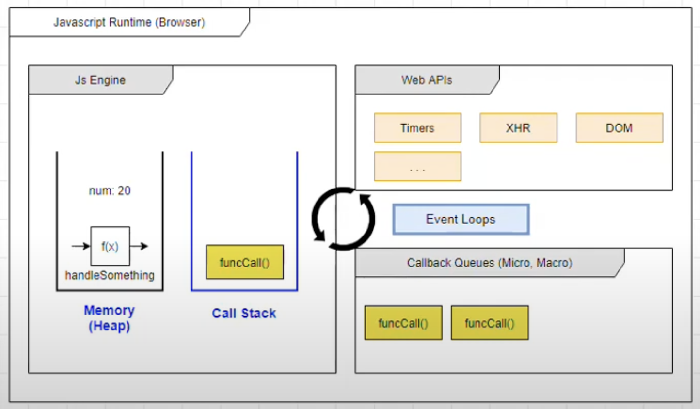

# 
Single threaded & Blocking

- **Javascript** là ngôn ngữ đơn luồng.

- Đơn luồng: tại 1 thời điểm chỉ có duy nhất một câu lệnh được thực thi.

- Thực thi theo kiểu đồng bộ từng dòng.

- Nếu chỉ mỗi Javascript Engine thì chưa đủ. Vậy cần thêm gì để giúp Javascript thực sự mạnh mẽ?

- Các thành phần cốt lõi của Javascript:
  - Thread of execution.
  - Memory/variable environment.
  - Call stack.
- Và cần nhiều thành phần nữa để xử lí:
  - Web APIs.
  - Event Loop.
  - Callback Queues.
    - Macro task queue và micro task queue.

