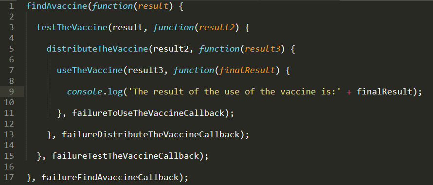

# <div align="center">Callback Hell & Địa ngục Callback</div>



- Không liên quan tới hình dạng Code như mũi tên từ trái qua phải.

```Javascript
fnGetData1(function (res1) {
	console.log(res1)
	fnGetData2(function (res2) {
		console.log(res2)
		fnGetData3(function (res3) {
			console.log(res3)
		})
	})
})
```

```Javascript
// Sau khi refactor vân còn tôn tại Callback Hell
function cbData1(res1) {
	console.log(res1)
	fnGetData2(cbData2)
}
function cbData2(res2){
	console.log(res2)
	fnGetData3(cbData3)
}
function cbData3(res3){
	console.log(res3)
}
fnGetData1(cbData1);
```

- Callback tồn tại 2 vấn đề cần phải cải thiện:
  1.  Xử lý lỗi (Error handling issues)
  2.  Giao quyền kiểm soát chương trình cho bên thứ 3 (Trust Issues).
      - Callback trong setTimeout WebAPIs gọi hàm nên mình không thể kiểm soát được việc thực thi hàm callback trong setTimeout.
