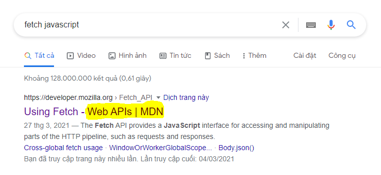

# 
Fetch & Promise

- **Fetch** là gì?

  - **Fetch** là một tính năng mới của **Web APIs** giúp chương trình Javascript có thể truy cập được vào các tính năng liên quan tới **HTTP Request** và **HTTP Response** thông qua Network.

- XMLHttpRequest (XHR), Ajax???

  -

- Đối với **setTimeout**:

  - Không thực hiện bất kỳ việc gì trong Javascript
  - Chỉ đơn giản gửi Function CB cho Web APIs xử lý với tính năng Timers

- Đối với **fetch**:

  - Khác với setTimeout, fetch thực hiện hai công việc, một phần bên Javascript và một phần bên Web APIs.
  - Phía Javascript: Khởi tạo ra một **Object** đặc biệt có tên là **Promise**.
  - Phía Web APIs: Giúp ứng dụng tương tác với các thành phần bên ngoài thông qua HTTP và Network.

- **Promise** là gì?

  - **Promise** là một Object đặc biệt được xây dựng sẵn (built-in) trong Javascript được sử dụng cho việc xử lý những tác vụ bất đồng bộ. Bên trong Object này sẽ chứa kết quả trả về (Thành công hoặc thất bại) của một tác vụ bát đồng bộ thông qua Network.
  - Liên tưởng tới **Thunk Pattern**
