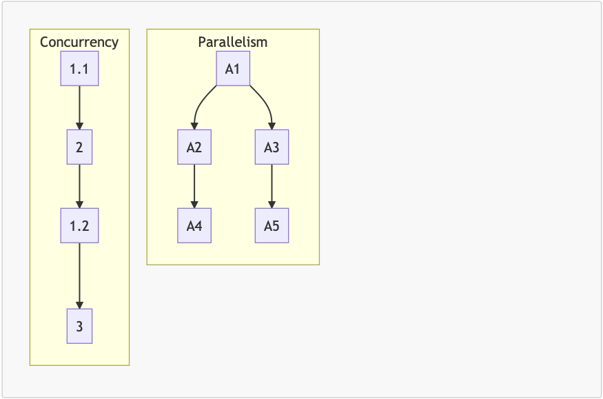

# 
Concurrency & Parallelism

- **Concurrency** (Đồng thời) : Là khi hai hay nhiều tác vụ có thể bắt đầu xử lý, đang xử lý và hoàn tất trong khoảng thời gian chồng chéo lên nhau (overlapping time).

- **Parallelism** (Song song) : Là khi hai hay nhiều tác vụ có thể bắt đầu xử lý, đang xử lý và hoàn tất trong chính xác cùng một thời điểm.

- **Javascript Concurrency Modal**

---

